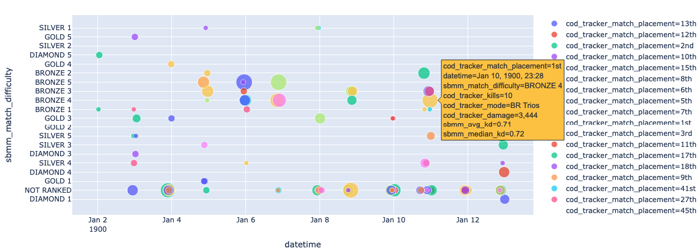

# Warzone Analytics 

Call of Duty Warzone is a popular video game. There are multiple sites that collect cruical information to analyze a player's gameplay. Here we collect important stats from multiple sites and save them to a CSV. Then use Google colab to visualize the data collected.




## Collect

### Requirements
- Installing Docker
There’s a graphical installer for Windows and Mac that makes installing Docker easy. Here are instructions for each OS:

    [Windows](https://docs.docker.com/docker-for-windows/install/)

    [Mac OS](https://docs.docker.com/docker-for-mac/install/)

    [Linux](https://docs.docker.com/engine/installation/linux/docker-ce/ubuntu/)

### Pull
```
docker pull lmestar/wz:0.2
```

### Run 
```
make USER=<Enter your PSN username>
```
