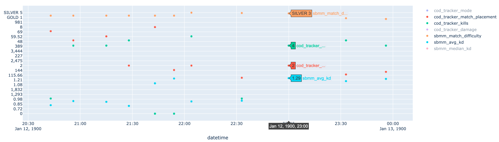
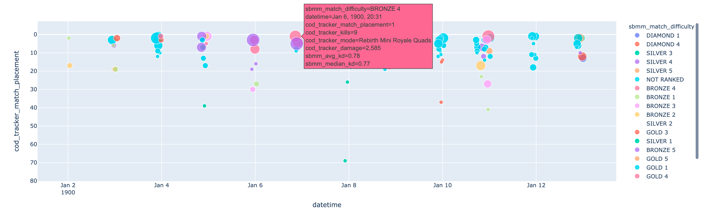
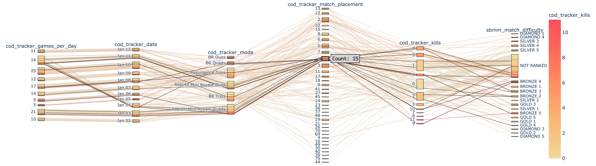

# Warzone Analytics 

Call of Duty Warzone is a popular video game. There are multiple sites that collect cruical information to analyze a player's gameplay. Here we collect important stats from multiple sites and save them to a CSV. Then use Google colab to visualize the data collected.

## Collect

### Requirements
- Installing Docker
There’s a graphical installer for Windows and Mac that makes installing Docker easy. Here are instructions for each OS:

    [Windows](https://docs.docker.com/docker-for-windows/install/)

    [Mac OS](https://docs.docker.com/docker-for-mac/install/)

    [Linux](https://docs.docker.com/engine/installation/linux/docker-ce/ubuntu/)

- **Windows Users:**
  - Download and install [Git Bash](https://gitforwindows.org/)
  - Make
    - Download make [here](https://sourceforge.net/projects/ezwinports/files/make-4.3-without-guile-w32-bin.zip/download).
    - Extract and copy content of the zip to `C:\Program Files\Git\mingw64\` without replace.
  
### Pull
```
docker pull lmestar/wz:0.2
```

### Run 
```
make USER=<Enter your PSN username> DAYS=<# of past days to collect>
```

## Visualize

### Scatter



### Bubbles



### Parallel Categories


